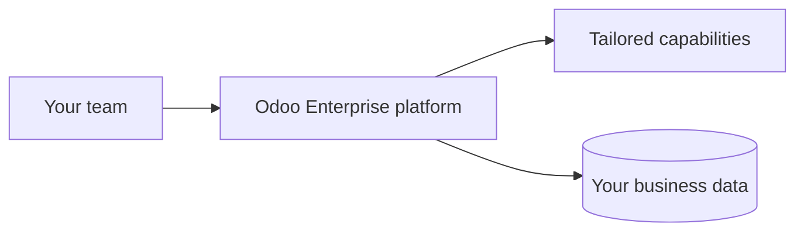
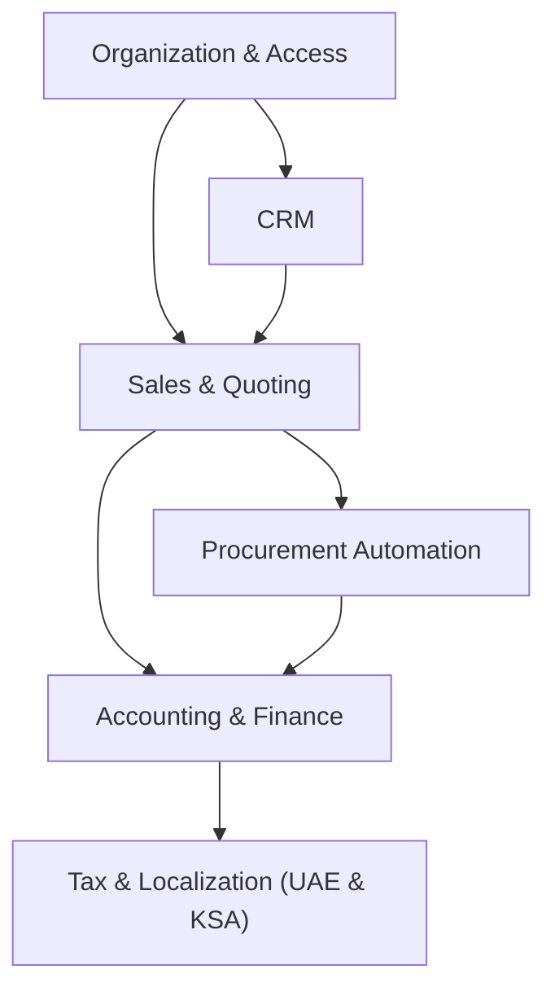

# Solution architecture

A high-level view of how your platform fits together. This page describes
structure and intent in business terms, not source code.

## Solution overview

Your business runs on Odoo Enterprise, extended by Growth Factors with a set of
capabilities tailored to how you sell, buy, and report, across the UAE and
Saudi operations.

## How the capabilities relate

Each capability owns a clear part of the business, and they connect through
supported, stable interfaces, so the whole platform behaves as one system.

## Design principles

- **Standard Odoo is extended, never modified** - you stay on a supported,
  upgradeable platform.
- **Each capability owns a clear area of the business** - no tangled overlaps.
- **Capabilities connect through stable interfaces** - changes in one area do
  not destabilise the others.
- **Compliance is built in** - regional tax and e-invoicing rules are part of
  the platform, not a manual step.

This architecture keeps the platform reliable today and straightforward to
extend as the business grows.
