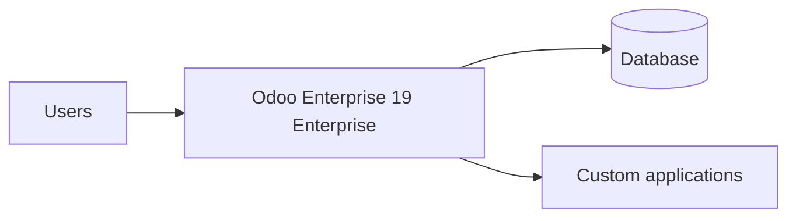

# Architecture

A high-level view of the Accienta Odoo Enterprise solution. This page
describes structure and intent, not source code.

## Solution overview

## Module map

<!-- GENERATED:module-map -->
_A dependency diagram of the custom modules is generated here._
<!-- /GENERATED:module-map -->

## Design principles

- Standard Odoo is extended, never modified.
- Each custom application owns a clear area of the business.
- Modules communicate through supported, stable interfaces.

For the decisions behind this architecture, see [Decisions](decisions.md).
